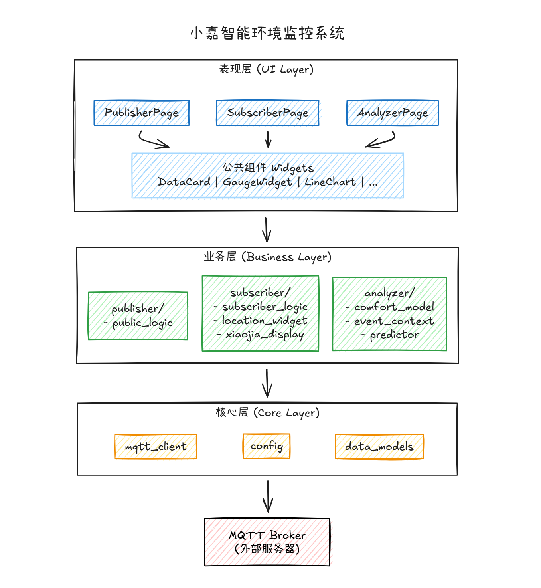

# 小嘉智能环境监控系统 - 项目文档

## 目录

```
1. 项目概述
   1.1 项目背景
   1.2 项目目标

2. 需求分析
   2.1 功能需求
       2.1.1 消息发布模块
       2.1.2 数据订阅模块
       2.1.3 智能分析模块
   2.2 非功能需求
   2.3 用户界面需求
   2.4 接口需求

3. 系统设计
   3.1 系统架构设计
   3.2 模块设计
       3.2.1 UI框架设计
       3.2.2 发布模块设计
       3.2.3 订阅模块设计
       3.2.4 分析模块设计
   3.3 数据存储方案
   3.4 接口设计

4. 核心算法设计
   4.1 消息发布模块
   4.2 数据订阅模块
   4.3 智能分析模块
  
5. 软件说明
   5.1 开发环境
   5.2 项目结构
   5.3 安装部署
   5.4 使用说明
   5.5 API文档

6. 附录
   6.1 参考资料
```

# 1. 项目概述

### 1.1 项目背景

在同济大学嘉定校区，环境舒适度对同学们的学习和生活有着直接的影响。然而，当前获取教学楼、图书馆等地方的温度、湿度等环境信息的方式却不够直观便捷，导致诸如“今天自习室是否闷热？”、“梅雨季节图书馆是否会返潮？”等问题得不到及时解答。这些环境监测数据通常以枯燥的数字形式呈现，缺乏与校园具体场景的有效结合，难以被广大学生快速理解和应用。

为了解决这一问题，我们开发了名为 **“小嘉”** 的环境数字助手。作为一款基于模拟传感器数据（包括温度、湿度、气压等）并通过 MQTT 协议实现数据发布与订阅的应用，“小嘉”致力于将环境数据转化为对学生日常生活有实际意义的信息。通过本地 GUI 界面进行数据可视化与智能解读，“小嘉”不仅能够展示实时的环境状况，还能根据特定模型分析出该环境下是否适宜学习或活动，并给出相应的建议。

不同于传统的数据看板，“小嘉”更注重用户体验与互动性，它能结合校园地图展示各个位置的具体环境条件，提供体感舒适度评估，并针对特殊事件（如高温预警、湿度过高等）主动推送温馨提醒，比如：“小嘉提醒：教学楼A栋当前体感舒适（25.3℃, 60%RH），适合自习！”、“小嘉提示：梅雨季节湿度偏高，请注意防潮。”等。这使得环境数据不仅仅是冰冷的数字，而是成为关心学生日常生活的贴心伙伴。

### 1.2 项目目标

“小嘉”的设计初衷是探索如何使环境数据更好地服务于校园生活，旨在创造一个既实用又富有情感的智慧校园解决方案。具体来说，我们的目标包括：

* **提升环境信息的可达性** ：利用MQTT协议实现实时数据的高效传输，确保学生可以随时访问最新的环境状况。
* **增强数据的理解性和实用性** ：通过构建舒适度评估模型，将抽象的数据转换成具体的建议，帮助用户判断某个地点是否适合作业或休息。
* **引入人性化交互元素** ：采用拟人化的设计理念，赋予系统个性化的形象——“小嘉”，使其能够像朋友一样向用户提供温暖且有用的提示。
* **促进校园社区的参与感** ：鼓励学生参与到智慧校园建设中来，通过反馈机制不断优化系统功能和服务质量，共同营造更加舒适和谐的学习生活环境。

综上所述，“小嘉”不仅仅是一个技术展示平台，更是连接校园环境与学生需求之间的桥梁，致力于让每一位使用者都能感受到来自科技的人文关怀。

# 2. 需求分析

本系统面向同济大学嘉定校区环境监控场景，旨在构建一个集数据发布、订阅、可视化与智能解读于一体的本地化桌面应用。系统以“小嘉”作为拟人化交互载体，强调易用性、实时性与校园情境感知。需求分为功能需求、非功能需求、用户界面需求及通信接口四部分。

### 2.1 功能需求

#### 2.1.1 消息发布模块

该模块允许用户模拟传感器或设备向 MQTT 服务器发送环境数据。主要功能包括：

- **连接配置**：支持配置 MQTT Broker 地址和端口（默认 127.0.0.1:1883），提供连接/断开控制
- **传感器配置**：可设置传感器ID、位置信息和备注信息
- **从文件发布**：支持从预设的数据文件（temperature.txt、humidity.txt、pressure.txt）批量发布数据，可设置发布间隔（0.01-10秒）
- **手动发布**：支持手动选择数据类型（temperature/humidity/pressure）并输入数值进行单条发布
- **发布监控**：实时显示发布进度条、已发布消息数量、数据文件记录数
- **发布日志**：记录所有发布操作，包括时间戳、主题、数据类型和数值

系统支持一键发布，并自动记录历史操作以便回溯。提供基础的发布统计信息（如总次数、成功数），支持实时进度显示和日志查看。

#### 2.1.2 数据订阅模块

作为系统的核心交互入口，订阅模块支持用户订阅三类环境数据主题，实时接收并解析来自模拟传感器的消息。主要功能包括：

- **主题选择**：通过复选框选择订阅主题（温度、湿度、气压），对应主题为 `sensor/temperature`、`sensor/humidity`、`sensor/pressure`
- **独立数据面板**：三类数据分别展示在独立的上下排列的数据面板中，每个面板包含：
  - 左侧：数据展示卡片，显示当前值、单位和状态指示
  - 右侧：实时趋势图，动态显示数据变化曲线
- **动态显示**：未订阅的主题对应的数据面板自动隐藏，订阅后自动显示
- **小嘉智能助手**：增强版显示组件，包含：
  - 大号头像区域（80x80像素），根据状态动态变化表情
  - 状态指示器，显示当前环境状态（正常/炎热/潮湿/偏冷）
  - 智能提示信息，根据环境数据生成温馨提醒
  - 呼吸灯动画效果，正常状态缓慢呼吸，警告状态快速闪烁
- **地图展示**：结合校园地图展示传感器位置，接收数据时自动高亮对应区域
- **订阅列表**：显示所有已订阅的主题，支持双击取消订阅

特别地，每条消息若包含位置标识（如 `location: "教学楼A"`），系统将在界面中关联显示该位置信息，并与“小嘉”形象的状态联动——例如当温湿度处于舒适区间时，“小嘉”呈现绿色微笑状态；异常时则变为黄色或红色警示表情。

#### 2.1.3 智能分析模块

在基础数据展示之上，系统需提供轻量级但实用的智能分析能力：

- 通过仪表盘和折线图实时呈现温度、湿度等关键参数的变化趋势；
- 基于预设的舒适度模型计算当前环境舒适指数，并生成通俗易懂的建议语句（如“适合自习”或“建议通风”）；
- 支持对异常值（如突升的温度、持续高湿）进行检测并触发告警；
- 在时间维度上提供短期趋势预测（如未来5分钟变化方向），辅助用户预判环境变化。

### 2.2 非功能需求

系统需在普通笔记本电脑上流畅运行，满足以下质量属性：

- **性能**：界面操作响应时间不超过 100 毫秒，数据从接收到刷新延迟控制在 1 秒以内，内存占用不超过 500MB；
- **可靠性**：在正常网络条件下，系统应保持 99% 以上的可用性，MQTT 消息丢失率低于 0.1%；
- **兼容性**：支持 Windows 10 及以上、主流 Linux 发行版，Python 版本不低于 3.8；
- **安全性**：MQTT 连接支持用户名/密码认证，并可选启用 TLS 加密（端口 8883）以保障通信安全。

### 2.3 用户界面需求

界面设计遵循“深色工业风”美学，契合技术监控系统的专业感，同时融入亲和力元素：

- 采用深灰背景与青蓝色主色调，关键控件添加**发光边缘与渐变效果**（如标题栏、按钮）；
- 所有图表与数值变化需具备**平滑动画过渡**，避免视觉跳变；
- “小嘉”形象作为状态指示器，通过**颜色与表情变化**直观反映系统健康度与环境舒适度（绿色=良好，黄色=注意，红色=异常）；
- 界面需适配高 DPI 显示屏，确保在 2K/4K 屏幕下文字与图标清晰锐利。

### 2.4 MQTT 接口规范

系统通过标准 MQTT 协议（兼容 3.1.1 与 5.0）与消息代理通信。用户可配置服务器地址、端口（默认 1883，TLS 模式为 8883）、用户名及密码。所有发布与订阅操作均支持 QoS 0/1/2 级别，可根据数据重要性灵活选择。连接过程需具备断线重连机制，保障长时间运行的稳定性。

# 3. 系统设计

## 3.1 系统架构设计

### 3.1.1 整体架构图

本系统采用**分层架构 + 模块化设计**，整体划分为 **UI 层、业务逻辑层、核心通信层** 三个层次，各模块通过明确定义的接口交互，确保高内聚、低耦合。系统以 **PyQt5 构建的图形界面** 作为用户入口，通过 **MQTT 客户端** 与本地消息代理通信，实现模拟传感器数据的发布与订阅。

架构自上而下分为三层：

- **UI 层**：负责页面布局、用户交互、数据可视化；
- **业务逻辑层**：包含发布、订阅、分析三大功能模块，封装各自领域逻辑；
- **核心通信层**：提供统一的 MQTT 客户端封装，屏蔽底层协议细节。



### 3.2 模块详细设计

#### 3.2.1 UI 框架设计

系统主窗口继承自 `QMainWindow`，采用 **侧边栏导航 + 页面栈切换** 的模式，提升多页面管理效率。

- **BaseWindow**：定义通用窗口结构，包含标题栏、状态提示区，提供统一的状态消息接口（如“连接成功”“发布失败”）。
- **MainWindow**：实现具体导航逻辑，管理三个核心页面（发布页、订阅页、分析页），并监听 MQTT 连接状态以更新全局 UI（如连接指示灯）。
- **BasePage**：所有功能页面的基类，提供标准化的 UI 构建方法（如创建卡片网格、面板标题），并定义抽象方法 `init_ui()` 强制子类实现界面初始化。
- **组件库**：封装了可复用的 UI 元素，包括：
  - **数据卡片**（DataCard/MiniCard）：用于展示温度、湿度等数值及其状态；
  - **仪表盘组件**（GaugeWidget/DashboardGauge）：以环形或指针形式可视化关键指标；
  - **图表组件**（LineChart/BarChart）：支持实时数据绘图与动态更新。

该设计确保 UI 风格统一、代码复用率高，并便于未来扩展新页面。

#### 3.2.2 发布模块设计

发布模块允许用户手动构造并发送 MQTT 消息，主要用于模拟传感器行为或测试通信链路。

- **PublisherLogic**：核心逻辑类，封装 MQTT 发布操作。维护发布计数、成功率统计及历史记录（最多 100 条）。提供 `publish()` 方法，返回操作是否成功，并通过 `published` 信号通知 UI 更新结果。
- **PublishRecord**：轻量级数据结构，记录每次发布的主题、消息内容、时间戳、QoS 等信息，供历史查看使用。
- **交互流程**：用户在界面填写主题与 JSON 消息 → 点击“发布” → 调用 `PublisherLogic.publish()` → 若成功，MQTT 客户端发送 PUBLISH 报文 → 收到 PUBACK 后触发信号 → UI 显示绿色成功提示；失败则显示红色错误。

该模块支持基础统计与历史回溯，满足调试与演示需求。

#### 3.2.3 订阅模块设计

订阅模块负责监听指定 MQTT 主题，接收并解析环境数据，同时驱动“小嘉”形象与位置地图的动态反馈。

- **SubscriberLogic**：管理订阅生命周期，维护已订阅主题列表，缓存最近 N 条消息。通过 `message_received` 信号将原始 payload 传递给 UI。
- **LocationWidget**：自定义地图控件，内置嘉定校区关键建筑坐标（如教学楼 A、图书馆）。当接收到带 `location` 字段的消息时，自动高亮对应区域。
- **XiaojiaDisplay**：拟人化助手组件，根据当前环境舒适度动态切换表情与颜色：
  - **绿色/微笑**：舒适（如 24°C, 50%RH）；
  - **黄色/皱眉**：一般（偏热或偏湿）；
  - **红色/警觉**：异常（超出阈值）。
    同时支持“说话”功能，显示如“适合自习！”等提示语。

该模块将冷数据转化为有温度的校园情境反馈，是系统创新点的核心载体。

#### 3.2.4 分析模块设计

分析模块在订阅数据基础上，提供轻量级智能解读能力，无需外部模型或网络。

- **ComfortModel**：实现本地舒适度算法。采用简化公式：`comfort = 100 - |T - 24| × 3 - |H - 50| × 0.5`，输出 0–100 的舒适指数，并映射为“优/良/中/差”等级，同时生成建议（如“建议开启除湿”）。
- **EventContext**：基于预设阈值（如温度 >35°C 触发高温告警）检测异常事件。支持注册回调函数，在事件发生时触发 UI 告警（弹窗、声音、状态变红）。
- **Predictor**：提供三种短期趋势预测算法：
  - **简单移动平均**（SMA）：适用于平稳数据；
  - **指数平滑**（EMA）：对近期变化更敏感；
  - **线性回归**：捕捉上升/下降趋势。
    默认预测未来 5–10 个时间点，用于绘制趋势线。

所有分析结果以图表、仪表盘、文本建议等形式集成到 AnalyzerPage，形成闭环感知。

### 3.3 数据存储方案

鉴于项目为轻量级本地应用，**不引入数据库**，采用以下策略管理数据：

- **数据文件**：位于 `publisher/` 目录下，包含：
  - `temperature.txt`：温度数据文件
  - `humidity.txt`：湿度数据文件
  - `pressure.txt`：气压数据文件
  每个文件包含JSON格式的时间序列数据，用于批量发布
- **运行时数据**：
  - 发布历史：内存列表，程序退出后不持久化，实时显示在发布日志中
  - 订阅消息：三类数据（温度、湿度、气压）分别维护历史记录，每类最多保留50个数据点用于趋势图显示
  - 分析数据：滑动时间窗口（默认100个点），用于计算趋势与预测
  - 舒适度历史：最多保留1000条记录，用于统计分析

### 3.4 关键接口设计

#### 核心通信接口

系统使用 paho-mqtt 库实现 MQTT 通信，通过两个独立的逻辑类封装：

**PublisherLogic**（`publisher/publish_logic.py`）：
- 回调接口：`set_on_message()`, `set_on_connection()`, `set_on_publish_complete()`
- 连接方法：`connect()`, `disconnect()`, `is_connected()`
- 发布方法：`publish_single()`, `start_publish_from_files()`, `stop_publish()`
- 配置方法：`set_sensor_config()`
- 特性：支持从文件批量发布、手动单条发布、发布进度跟踪

**SubscriberLogic**（`subscriber/subscriber_logic.py`）：
- 回调接口：`set_on_message()`, `set_on_connection()`
- 连接方法：`connect()`, `disconnect()`, `is_connected()`
- 订阅方法：`subscribe()`, `unsubscribe()`, `list_subscriptions()`
- 特性：支持自动重连、连接状态检测、主题过滤验证

#### 模块调用接口规范

各页面通过标准方式调用逻辑层：

- **PublisherPage** → 创建 `PublisherLogic` 实例，连接 `published` 和 `connection_changed` 信号，通过 `publish_single()` 或 `start_publish_from_files()` 发布数据
- **SubscriberPage** → 创建 `SubscriberLogic`，连接 `message_received` 信号，解析 payload 后更新对应的数据面板（DataCard + LineChart），驱动 LocationWidget 与 XiaojiaDisplay
- **AnalyzerPage** → 组合使用 `XiaojiaBrain`（包含 `ComfortModel`、`EventContext`、`Predictor`），定期（或消息到达时）更新分析结果

接口设计遵循"逻辑与界面分离"原则，便于单元测试与团队协作。

# 4. 核心算法设计

### 4.1 消息发布模块

#### 4.1.1 文件数据读取算法

系统从三个数据文件（temperature.txt、humidity.txt、pressure.txt）读取数据，每个文件包含JSON格式的时间序列数据。

**算法流程**：
1. 遍历三个数据文件，解析每行的JSON数据
2. 提取时间戳和数值，构建三元组 `(timestamp, data_type, value)`
3. 按时间戳对所有记录进行排序
4. 按设定的发布间隔（默认0.2秒）依次发布

**优化**：使用后台线程执行发布任务，避免阻塞UI，支持随时停止发布。

#### 4.1.2 消息格式规范

发布的消息采用标准JSON格式，包含 `timestamp`、`value`、`sensor_id`、`location`、`extra`、`type` 字段。主题格式：`sensor/{type}`，其中 `{type}` 为 `temperature`、`humidity` 或 `pressure`。


### 4.2 数据订阅模块

#### 4.2.1 主题订阅管理算法

系统支持三类主题的独立订阅管理：用户勾选复选框 → 调用 `SubscriberLogic.subscribe()` → 验证主题格式 → 建立MQTT订阅 → 显示对应数据面板。取消订阅时隐藏数据面板并清空历史数据。订阅端每3秒检测一次连接状态，自动尝试连接broker。

#### 4.2.2 数据分类存储算法

接收到的消息根据 `type` 字段分类存储到 `data_history` 字典中，每类最多保留50个数据点。每个数据点更新时，同步更新对应的数据卡片和趋势图。

#### 4.2.3 小嘉状态判断算法

根据接收到的环境数据动态判断小嘉的状态：温度 >= 30℃ 为 `hot`，<= 5℃ 为 `cold`；湿度 >= 80% 为 `humid`；气压 < 990hPa 或 > 1030hPa 为异常状态。


### 4.3 智能分析模块

#### 4.3.1 舒适度计算算法

**ComfortModel** 实现综合舒适度评估：

- **温湿指数（THI）**：`THI = 0.8 × T + H × 0.01 × (0.8 × T - 14.3) + 46.3`
- **体感温度**：`FeelsLike = T + 0.3 × H × 0.01 - 2.7`
- **温度评分**：18-26℃为100分，超出范围按偏差扣分
- **湿度评分**：40-60%为100分，超出范围按偏差扣分
- **压力评分**：基于上海市月平均气压参考值计算偏差
- **综合舒适度**：`ComfortScore = 0.5 × TempScore + 0.3 × HumidityScore + 0.2 × PressureScore`

舒适度等级：80-100为非常舒适，60-80为舒适，40-60为一般，20-40为不舒适，0-20为非常不舒适。

#### 4.3.2 趋势预测算法

**XiaojiaBrain** 实现短期趋势预测：维护三类数据的历史记录（最多100个点），使用滑动窗口（默认20个点）进行预测。当数据点 >= 20时，使用线性回归预测未来5个时间点；数据不足时使用简单平均预测。趋势判断基于最近3个点的变化。

#### 4.3.3 事件匹配算法

**EventContext** 实现校园事件识别：定义课堂教学、午间休息、体育课、高温预警、高湿天气、低压天气等事件。匹配算法检查时间范围、位置匹配和传感器数据触发条件，按优先级排序返回匹配的事件，并生成相应的自然语言提示。


## 5. 软件说明

### 5.1 开发环境

**编程语言**：Python 3.8+

**主要依赖**：
- PyQt5 5.15.11：GUI框架
- paho-mqtt 2.1.0：MQTT客户端库
- numpy：数值计算（用于舒适度计算和预测）
- scikit-learn：机器学习库（用于线性回归预测）

**开发工具**：
- IDE：推荐使用 PyCharm 或 VS Code
- 版本控制：Git
- MQTT Broker：Mosquitto（本地部署）

### 5.2 项目结构

```
xiaojia_project/
├── main.py                          # 程序入口
├── requirements.txt                 # 依赖包列表
├── mosquitto_simple.conf            # MQTT Broker配置文件
├── run_mosquitto.bat               # Windows启动脚本
│
├── analyzer/                       # 智能分析模块
│   ├── comfort_model.py           # 舒适度计算模型
│   ├── event_context.py           # 校园事件匹配引擎
│   ├── predictor.py                # 趋势预测算法（XiaojiaBrain）
│   └── analyzer_ui.py             # 分析界面UI组件
│
├── publisher/                      # 发布模块
│   ├── publish_logic.py           # 发布逻辑封装
│   ├── temperature.txt            # 温度数据文件
│   ├── humidity.txt               # 湿度数据文件
│   └── pressure.txt               # 气压数据文件
│
├── subscriber/                     # 订阅模块
│   ├── subscriber_logic.py        # 订阅逻辑封装
│   ├── xiaojia_display.py         # 小嘉形象展示组件（增强版）
│   └── location_widget.py         # 位置信息组件
│
├── ui/                            # UI层
│   ├── main_window.py            # 主窗口
│   ├── base_window.py            # 基础窗口类
│   ├── styles/
│   │   └── dark_theme.py         # 深色主题样式
│   ├── pages/                    # 页面模块
│   │   ├── base_page.py         # 页面基类
│   │   ├── publisher_page.py     # 发布页面
│   │   ├── subscriber_page.py    # 订阅页面
│   │   └── analyzer_page.py     # 分析页面
│   └── widgets/                  # UI组件库
│       ├── data_card.py          # 数据卡片组件
│       ├── chart_widget.py       # 图表组件（折线图、柱状图、饼图）
│       ├── gauge_widget.py      # 仪表盘组件
│       └── map_widget.py         # 地图组件
│
└── assets/                        # 资源文件
    ├── structure.png             # 架构图
    ├── map.png                   # 校园地图
    └── tongji.png                # 同济大学Logo
```


### 5.3 使用说明

#### 5.3.1 启动顺序

1. **启动 MQTT Broker** 

```bash
# Windows
.\mosquitto.exe -c mosquitto_simple.conf
```

2. **启动应用程序**

```bash
python main.py
```

#### 5.3.2 发布数据

**步骤1：连接MQTT Broker**
- 在"消息发布"页面，配置Broker地址（默认127.0.0.1）和端口（默认1883）
- 点击"连接"按钮
- 等待连接成功（状态显示"已连接"）

**步骤2：配置传感器信息**
- 填写传感器ID（如：JX_Teach_01）
- 填写位置信息（如：教学楼A）
- 填写备注（如：三楼301教室）

**步骤3：选择发布方式:** 
- 从文件批量发布或手动发布单条

**步骤4：查看发布日志**
- 在发布日志区域查看所有发布记录
- 包括时间戳、主题、数据类型和数值

#### 5.3.3 订阅数据

**步骤1：选择订阅主题**
- 在"数据订阅"页面，勾选要订阅的主题：
  - 温度（sensor/temperature）
  - 湿度（sensor/humidity）
  - 气压（sensor/pressure）
- 订阅成功后，对应的数据面板会自动显示

**步骤2：查看数据**
- 每个数据面板左侧显示当前数值和状态
- 右侧显示实时趋势图
- 数据会根据接收到的消息实时更新

**步骤3：查看小嘉提示**
- 小嘉智能助手会根据环境数据显示状态和提示
- 状态包括：正常、炎热、潮湿、偏冷
- 提示信息会根据数据值生成相应的建议

**步骤4：取消订阅**
- 取消勾选复选框，或双击订阅列表中的项
- 对应的数据面板会自动隐藏

#### 5.3.4 智能分析

**功能说明**：
- 分析页面自动接收订阅的数据
- 计算综合舒适度指数（0-100分）
- 提供趋势预测（未来5个时间点）
- 匹配校园事件并生成建议

**查看分析结果**：
- 舒适度仪表盘：显示当前舒适度分数和等级
- 趋势图表：显示历史数据和预测趋势
- 事件列表：显示当前匹配的校园事件
- 小嘉建议：显示智能生成的提示语

### 5.4 API文档

#### 5.4.1 PublisherLogic API

**类**：`publisher.publish_logic.PublisherLogic`

**初始化**：
```python
logic = PublisherLogic(broker="127.0.0.1", port=1883, keepalive=60)
```

**主要方法**：

- `connect() -> bool`：连接到MQTT Broker，返回是否成功
- `disconnect()`：断开连接
- `is_connected() -> bool`：检查连接状态
- `set_sensor_config(sensor_id: str, location: str, extra: str)`：设置传感器配置
- `publish_single(data_type: str, value: float, timestamp: str = None) -> bool`：发布单条消息
- `start_publish_from_files(interval: float = 0.2) -> bool`：从文件开始批量发布
- `stop_publish()`：停止发布
- `load_records()`：加载数据文件记录

**回调设置**：
- `set_on_message(callback)`：设置消息发布回调
- `set_on_connection(callback)`：设置连接状态回调
- `set_on_publish_complete(callback)`：设置发布完成回调

#### 5.4.2 SubscriberLogic API

**类**：`subscriber.subscriber_logic.SubscriberLogic`

**初始化**：
```python
logic = SubscriberLogic(broker="127.0.0.1", port=1883, keepalive=60)
```

**主要方法**：

- `connect()`：连接到MQTT Broker
- `disconnect()`：断开连接
- `is_connected() -> bool`：检查连接状态
- `subscribe(topic: str) -> bool`：订阅主题，返回是否成功
- `unsubscribe(topic: str)`：取消订阅主题
- `list_subscriptions()`：获取已订阅主题列表

**回调设置**：
- `set_on_message(callback)`：设置消息接收回调，参数为解析后的dict
- `set_on_connection(callback)`：设置连接状态回调，参数为True/False

#### 5.4.3 ComfortModel API

**类**：`analyzer.comfort_model.ComfortModel`

**主要方法**：

- `calculate_comfort_index(temp: float, humidity: float, pressure: float) -> Dict`：计算舒适度指数
  - 返回包含 `comfort_score`、`comfort_level`、`thi`、`feels_like` 等的字典
- `add_historical_data(data: Dict)`：添加历史数据
- `get_statistics() -> Dict`：获取统计信息（平均值、标准差等）
- `get_shanghai_reference() -> Dict`：获取上海市参考值

#### 5.4.4 XiaojiaBrain API

**类**：`analyzer.predictor.XiaojiaBrain`

**主要方法**：

- `process_sensor_data(sensor_data: Dict, location: str, sensor_id: str) -> Dict`：处理传感器数据，返回综合分析结果
- `predict_next(steps: int = 5) -> Dict`：预测未来steps个时间点的数值
- `get_trend_analysis() -> Dict`：获取趋势分析（上升/下降/稳定）
- `get_historical_data(data_type: str) -> Dict`：获取历史数据
- `get_comfort_statistics() -> Dict`：获取舒适度统计
- `set_realtime_callback(callback)`：设置实时数据回调

# 6. 附录

### 6.1 参考资料

- **MQTT协议规范**：MQTT Version 3.1.1 和 5.0 标准文档
- **PyQt5文档**：https://www.riverbankcomputing.com/static/Docs/PyQt5/
- **paho-mqtt文档**：https://www.eclipse.org/paho/clients/python/
- **Mosquitto文档**：https://mosquitto.org/documentation/
- **scikit-learn文档**：https://scikit-learn.org/stable/
